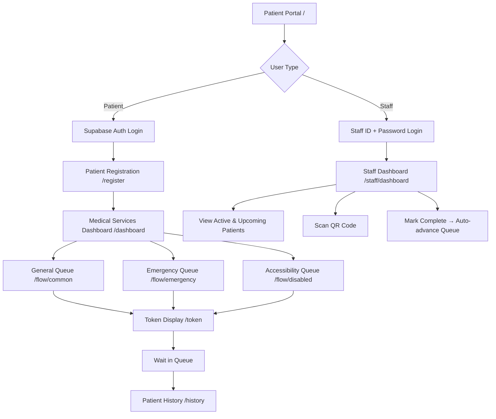
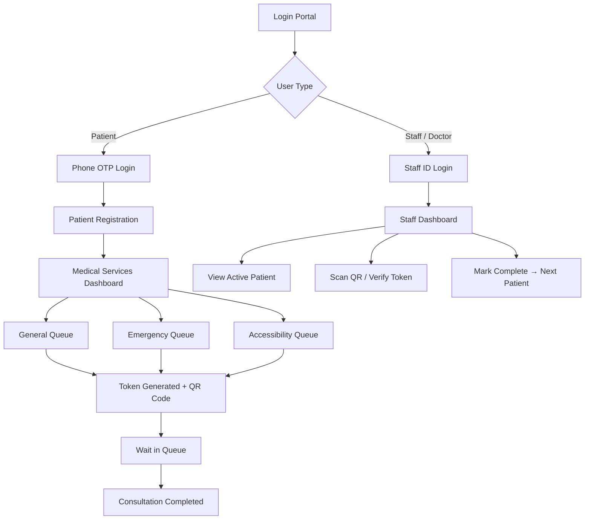

# 🏥 Smart Queue Alert — Hospital Management System

A modern, full-stack **hospital queue management web application** built with **React + Vite** on the frontend and **Express.js + Supabase** on the backend. It streamlines patient registration, token-based queuing, real-time department stats, and staff workflows — all from a responsive web interface.

---

## ✨ Features

### 🧑‍⚕️ Patient Portal
- **Supabase Auth** — Secure patient authentication (email/OTP)
- **Patient Registration** — Capture name, age, gender, phone, and department selection
- **Token Generation** — Automatic queue tokens with downloadable QR codes
- **Three Queue Lanes:**
  - 🟢 **General** — Standard walk-in appointments
  - 🔴 **Emergency** — Priority fast-track with immediate queue escalation
  - ♿ **Accessibility** — Dedicated lane for disabled / special-needs patients
- **Token Display Page** — View your token, estimated wait time, and QR code
- **Patient History** — Review all past booked tokens with status

### 👨‍⚕️ Staff / Doctor Dashboard
- **Staff Login** — Secure staff ID + password authentication (JWT)
- **Live Queue View** — Displays active patient + upcoming patients at a glance
- **QR Scanner** — Camera-based QR code scanning to verify and complete appointments
- **Mark Complete** — One-tap completion automatically advances the queue
- **Staff Profile Edit** — Update name, email, and department details

### 📊 Department Statistics
- Real-time queue counts per department
- Average wait times and patient throughput analytics
- Department-level filtering and comparison

### 🌐 Multilingual Support
- Built-in translation support via `src/translations/`
- Extensible to add more languages

### 🎨 UI & Theming
- **Dark / Light mode** toggle via `ThemeToggle` component
- Custom settings modal (language, theme preferences)
- Inter & Poppins Google Fonts
- Flaticon UIcons icon library

---

## 🛠️ Tech Stack

### Frontend
| Layer | Technology |
|---|---|
| **Framework** | React 19 + Vite 8 |
| **Language** | JavaScript (JSX) |
| **Routing** | React Router DOM v7 |
| **Auth & DB** | Supabase (`@supabase/supabase-js`) |
| **Icons** | Lucide React, Flaticon UIcons |
| **Toasts** | React Hot Toast |
| **QR Code** | `qrcode`, `html5-qrcode` (generation & scanning) |
| **Export** | `html2canvas` (token card screenshot/download) |
| **Linter** | OXLint |

### Backend
| Layer | Technology |
|---|---|
| **Runtime** | Node.js |
| **Framework** | Express.js v5 |
| **Database** | Supabase (PostgreSQL via `@supabase/supabase-js`) |
| **Auth** | JWT (`jsonwebtoken`) + bcrypt (`bcryptjs`) |
| **Config** | `dotenv` |
| **CORS** | `cors` |

---

## 📁 Project Structure

```
SmartQWManagement/
├── .env                         # Root env (shared config if needed)
├── .gitignore
├── README.md
│
├── frontend/                    # React + Vite Web App
│   ├── index.html               # HTML entry point (Google Fonts, Flaticon)
│   ├── vite.config.js           # Vite configuration (proxy to backend)
│   ├── package.json
│   └── src/
│       ├── main.jsx             # React DOM entry point
│       ├── App.jsx              # Root component with routing & providers
│       ├── App.css              # Global app styles
│       ├── index.css            # Design system & CSS variables
│       │
│       ├── api/
│       │   ├── index.js         # Centralized API call helpers (backend REST)
│       │   └── supabaseClient.js # Supabase client instance
│       │
│       ├── context/
│       │   ├── AppContext.jsx   # Global app state (departments, queue, theme)
│       │   └── AuthContext.jsx  # Supabase auth state & session management
│       │
│       ├── components/
│       │   ├── Header.jsx              # Top navigation bar
│       │   ├── ThemeToggle.jsx         # Dark/light mode switch
│       │   ├── SettingsModal.jsx       # Language & theme settings
│       │   ├── EditProfileModal.jsx    # Staff profile editor
│       │   ├── QrCameraScannerModal.jsx # Camera QR scanner modal
│       │   ├── Flaticon.jsx            # Flaticon icon wrapper
│       │   └── ui/                     # Reusable UI primitives
│       │
│       ├── pages/
│       │   ├── PatientPortalPage.jsx          # / — Landing / login portal
│       │   ├── PatientRegistrationPage.jsx    # /register
│       │   ├── MedicalServicesDashboardPage.jsx # /dashboard
│       │   ├── CommonUserFlowPage.jsx         # /flow/common & /queue/common
│       │   ├── EmergencyUserFlowPage.jsx      # /flow/emergency & /queue/emergency
│       │   ├── DisabledUserFlowPage.jsx       # /flow/disabled & /queue/disabled
│       │   ├── TokenDisplayPage.jsx           # /token
│       │   ├── DepartmentStatsPage.jsx        # /department-stats
│       │   ├── PatientHistoryPage.jsx         # /history
│       │   ├── StaffLoginPage.jsx             # /staff/login
│       │   └── StaffDashboardPage.jsx         # /staff/dashboard
│       │
│       ├── hooks/               # Custom React hooks
│       ├── translations/        # i18n translation strings
│       └── assets/              # Static assets (images, icons)
│
└── server/                      # Express.js REST API
    ├── index.js                 # Server entry point (port 5000)
    ├── supabase.js              # Supabase admin client
    ├── schema.sql               # Full PostgreSQL database schema (v2.0)
    ├── seed.sql                 # Seed data for departments, doctors, staff
    ├── package.json
    └── routes/
        ├── auth.js              # POST /api/auth/* — patient & staff auth
        ├── queue.js             # GET/POST /api/queue/* — queue management
        └── staff.js             # GET/PUT /api/staff/* — staff operations
```

---

## 🚀 Getting Started

### Prerequisites

- **Node.js** ≥ 18
- **npm** ≥ 9
- **Supabase Account** — [supabase.com](https://supabase.com)

### 1. Clone the Repository

```bash
git clone https://github.com/Sameer4821/SmartQManagement.git
cd SmartQWManagement
```

### 2. Set Up the Backend

```bash
cd server
npm install
```

Create a `.env` file inside `server/`:

```env
PORT=5000
CLIENT_URL=http://localhost:5173
SUPABASE_URL=https://your-project.supabase.co
SUPABASE_ANON_KEY=your-anon-key
SUPABASE_SERVICE_ROLE_KEY=your-service-role-key
JWT_SECRET=your-jwt-secret
```

### 3. Set Up the Frontend

```bash
cd ../frontend
npm install
```

Create a `.env` file inside `frontend/`:

```env
VITE_SUPABASE_URL=https://your-project.supabase.co
VITE_SUPABASE_ANON_KEY=your-anon-key
VITE_API_URL=http://localhost:5000
```

### 4. Set Up the Database

1. Open your Supabase project dashboard
2. Navigate to **SQL Editor**
3. Paste and run the contents of [`server/schema.sql`](server/schema.sql) to create all tables
4. Optionally run [`server/seed.sql`](server/seed.sql) to populate departments, doctors, and demo staff

### 5. Run the App

**Start the backend** (from `/server`):
```bash
npm run dev
```

**Start the frontend** (from `/frontend`):
```bash
npm run dev
```

The frontend will be available at **http://localhost:5173** and the API at **http://localhost:5000**.

---

## 🗺️ App Routes

| Route | Component | Description |
|---|---|---|
| `/` | `PatientPortalPage` | Landing page & patient login |
| `/register` | `PatientRegistrationPage` | Patient registration form |
| `/dashboard` | `MedicalServicesDashboardPage` | Select queue type |
| `/flow/common` | `CommonUserFlowPage` | General queue flow |
| `/flow/emergency` | `EmergencyUserFlowPage` | Emergency queue flow |
| `/flow/disabled` | `DisabledUserFlowPage` | Accessibility queue flow |
| `/token` | `TokenDisplayPage` | Token & QR code display |
| `/department-stats` | `DepartmentStatsPage` | Department analytics |
| `/history` | `PatientHistoryPage` | Patient visit history |
| `/staff/login` | `StaffLoginPage` | Staff authentication |
| `/staff/dashboard` | `StaffDashboardPage` | Staff queue management |

---

## 🗄️ Database Schema

The database schema (`server/schema.sql`) includes the following core tables:

| Table | Description |
|---|---|
| `hospital_settings` | Global hospital config (name, contact, operating hours) |
| `departments` | Departments with queue counts & average wait times |
| `staff_accounts` | Staff authentication (ID, password hash, role, department) |
| `doctors` | Doctor profiles, specialization, and live availability status |
| `patients` | Registered patient profiles with accessibility flags |
| `queue_tokens` | Queue tokens (lane type, priority, status, QR code) |

---

## 🌐 API Endpoints

### Auth — `/api/auth`
| Method | Path | Description |
|---|---|---|
| `POST` | `/api/auth/staff/login` | Staff login (returns JWT) |
| `POST` | `/api/auth/patient/register` | Patient registration |

### Queue — `/api/queue`
| Method | Path | Description |
|---|---|---|
| `GET` | `/api/queue/:department` | Get active queue for department |
| `POST` | `/api/queue/token` | Generate new queue token |
| `PUT` | `/api/queue/token/:id/complete` | Mark token as completed |

### Staff — `/api/staff`
| Method | Path | Description |
|---|---|---|
| `GET` | `/api/staff/profile` | Get authenticated staff profile |
| `PUT` | `/api/staff/profile` | Update staff profile |

---

## 🔄 App Flow



---

## ⚙️ Configuration

### Vite (`vite.config.js`)
The Vite dev server is configured to proxy `/api` requests to the Express backend at `http://localhost:5000`, avoiding CORS issues during development.

### Supabase Auth
Authentication is handled both at the frontend (Supabase client for patient login) and backend (JWT for staff sessions). Ensure your Supabase project has the appropriate auth providers enabled.

---

## 🤝 Contributing

1. **Fork** the repository
2. **Create** a feature branch: `git checkout -b feature/your-feature`
3. **Commit** your changes: `git commit -m "feat: add your feature"`
4. **Push** to the branch: `git push origin feature/your-feature`
5. **Open** a Pull Request

---

## ✨ Features

### 🧑‍⚕️ Patient Portal
- **OTP-based Phone Authentication** — Secure login via Supabase Auth + Twilio OTP
- **Patient Registration** — Capture name, age, gender, phone, and department selection
- **Token Generation** — Automatic queue tokens with QR codes for easy verification
- **Three Queue Lanes:**
  - 🟢 **General** — Standard walk-in appointments
  - 🔴 **Emergency** — Priority fast-track with instant alerts to staff
  - ♿ **Accessibility** — Dedicated lane for disabled / special-needs patients
- **Real-time Wait Estimates** — AI-optimized time predictions based on queue position, department load, and peak hours
- **Consultation Completed Screen** — Post-visit summary with visit details
- **Patient History** — View all past booked tokens sorted by priority and time

### 👨‍⚕️ Staff / Doctor Dashboard
- **Staff Login** — Secure staff ID + password authentication
- **Live Queue View** — Displays active patient (1) + upcoming patients (3) at a glance
- **QR Scanner** — Scan patient QR codes to auto-complete appointments
- **Mark Complete** — One-tap completion moves the queue forward automatically
- **Department Statistics** — Real-time analytics for token counts and wait times

### 🤖 AI & Smart Features
- **Agentic Chatbot** — AI-powered assistant for patient queries and navigation
- **AI Predictive Insights** — Queue forecasting and department load predictions
- **Smart Scheduling** — Optimal time-slot calculation accounting for peak hours and doctor availability

### 🌐 Multilingual Support
- Built-in Hindi and English translations
- Extensible translation system via `src/translations/`

### 🔔 Real-time Notifications
- Emergency alerts pushed to affected queue patients
- Delay warnings with estimated additional wait time
- Auto-clearing notification panel (30-second TTL)

---

## 🛠️ Tech Stack

| Layer | Technology |
|---|---|
| **Framework** | React Native + Expo SDK 52 |
| **Language** | JavaScript (JSX) |
| **Auth & Backend** | Supabase (Auth, Database, RLS) |
| **OTP Provider** | Twilio (via Supabase Phone Auth) |
| **State Management** | React Context API + AsyncStorage |
| **QR Codes** | `react-native-qrcode-svg` |
| **Camera / Scanner** | `expo-camera` |
| **Animations** | `react-native-reanimated` |
| **Icons** | `@expo/vector-icons`, `lucide-react-native` |
| **Toasts** | `sonner-native` |
| **Navigation** | Custom view-based routing |

---

## 📁 Project Structure

```
Smart Queue Alert Hospital Management System/
├── App.jsx                    # Root entry (re-exports src/App.jsx)
├── app.json                   # Expo configuration
├── package.json               # Dependencies & scripts
├── .env                       # Environment variables (Supabase keys)
│
├── lib/
│   └── supabase.js            # Supabase client initialization
│
├── screens/                   # OTP auth flow screens
│   ├── HomeScreen.js
│   ├── PhoneLoginScreen.js
│   └── OtpScreen.js
│
├── src/
│   ├── App.jsx                # Main application with routing & state
│   ├── types.js               # Shared type definitions
│   │
│   ├── components/
│   │   ├── LoginPortal.jsx         # Landing page with patient/staff entry
│   │   ├── PatientPortal.jsx       # Patient service selection
│   │   ├── CommonUserFlow.jsx      # General appointment flow
│   │   ├── EmergencyUserFlow.jsx   # Emergency registration flow
│   │   ├── DisabledUserFlow.jsx    # Accessibility registration flow
│   │   ├── TokenDisplay.jsx        # Generated token + QR code display
│   │   ├── PatientDetails.jsx      # Detailed patient information
│   │   ├── PatientHistory.jsx      # All past visits & tokens
│   │   ├── ConsultationCompleted.jsx # Post-consultation summary
│   │   ├── QueueCard.jsx           # Queue position card
│   │   ├── HomeScreen.jsx          # Home component
│   │   ├── Settings.jsx            # App settings (theme, language)
│   │   ├── DepartmentStatistics.jsx # Department analytics
│   │   ├── OTPInput.jsx            # OTP input component
│   │   ├── AgenticChatbot.jsx      # AI-powered chatbot
│   │   ├── Chatbot.jsx             # Basic chatbot fallback
│   │   ├── AIAgent.jsx             # AI agent logic
│   │   ├── AIPredictiveInsights.jsx # Predictive analytics UI
│   │   ├── auth/
│   │   │   ├── AuthRouter.jsx      # Auth flow router
│   │   │   └── LoginPage.jsx       # Login page UI
│   │   ├── figma/                  # Design reference components
│   │   └── ui/                     # Reusable UI primitives
│   │
│   ├── screens/
│   │   ├── PatientRegistrationScreen.jsx
│   │   ├── OTPVerificationScreen.jsx
│   │   ├── StaffLoginScreen.jsx
│   │   ├── StaffDashboard.jsx
│   │   └── MedicalServicesDashboard.jsx
│   │
│   ├── context/
│   │   └── AppContext.jsx          # Global app state & departments
│   │
│   ├── contexts/
│   │   └── AuthContext.jsx         # Supabase auth context provider
│   │
│   ├── services/
│   │   └── supabaseClient.js       # Supabase service client
│   │
│   ├── supabase/
│   │   ├── schema.sql              # Database schema (patients, staff)
│   │   └── functions/              # Supabase Edge Functions
│   │
│   ├── hooks/
│   │   └── useTranslation.js       # i18n hook
│   │
│   ├── translations/
│   │   ├── translations.js         # All translation strings
│   │   └── languages.js            # Supported language definitions
│   │
│   ├── styles/
│   │   └── globals.css             # Global stylesheet
│   │
│   ├── theme/                      # Theme configuration
│   ├── guidelines/
│   │   └── Guidelines.md           # UI/UX design guidelines
│   └── utils/                      # Utility helpers
│
└── assets/
    ├── icon.png
    ├── adaptive-icon.png
    ├── splash-icon.png
    └── favicon.png
```

---

## 🚀 Getting Started

### Prerequisites

- **Node.js** ≥ 16
- **npm** or **yarn**
- **Expo CLI** — `npm install -g expo-cli`
- **Supabase Account** — [supabase.com](https://supabase.com)
- **Expo Go** app on your phone (for testing)

### 1. Clone the Repository

```bash
git clone https://github.com/Sameer4821/Smart-Queue-Management.git
cd "Smart Queue Alert Hospital Management System"
```

### 2. Install Dependencies

```bash
npm install
```

### 3. Configure Environment Variables

Create a `.env` file in the project root with your Supabase credentials:

```env
EXPO_PUBLIC_SUPABASE_URL=https://your-project.supabase.co
EXPO_PUBLIC_SUPABASE_ANON_KEY=your-anon-key-here
```

### 4. Set Up the Database

1. Open your Supabase project dashboard
2. Navigate to **SQL Editor**
3. Paste and run the contents of [`src/supabase/schema.sql`](src/supabase/schema.sql)

This creates the `patients` and `staff_accounts` tables with Row Level Security (RLS) policies.

### 5. Run the App

```bash
npx expo start
```

Then scan the QR code with **Expo Go** (Android) or the **Camera** app (iOS).

| Platform | Command |
|---|---|
| Android | `npm run android` |
| iOS | `npm run ios` |
| Web | `npm run web` |

---

## 🗄️ Database Schema

### `patients`

| Column | Type | Description |
|---|---|---|
| `id` | UUID (PK) | Matches Supabase Auth `auth.uid()` |
| `phone_number` | TEXT (UNIQUE) | Patient's phone number |
| `created_at` | TIMESTAMPTZ | Auto-generated creation time |

### `staff_accounts`

| Column | Type | Description |
|---|---|---|
| `id` | UUID (PK) | Auto-generated |
| `staff_id` | TEXT (UNIQUE) | Staff login ID |
| `password_hash` | TEXT | Hashed password |
| `role` | TEXT | `'staff'` or `'admin'` |
| `created_at` | TIMESTAMPTZ | Auto-generated creation time |

Both tables have **Row Level Security** enabled — users can only access their own records.

---

## 📱 App Screens & Flow



---

## ⚙️ Configuration

### Expo (`app.json`)

- **App Name**: Smart Queue Management
- **Orientation**: Portrait only
- **New Architecture**: Enabled
- **Platforms**: iOS, Android, Web

### Supabase Auth

Phone OTP authentication is configured through Supabase with Twilio as the SMS provider. Ensure your Supabase project has:
1. **Phone Auth** enabled under Authentication → Providers
2. **Twilio** credentials configured (Account SID, Auth Token, Messaging Service SID)

---

## 🤝 Contributing

1. **Fork** the repository
2. **Create** a feature branch: `git checkout -b feature/your-feature`
3. **Commit** your changes: `git commit -m "Add your feature"`
4. **Push** to the branch: `git push origin feature/your-feature`
5. **Open** a Pull Request

---


---

<p align="center">
  Built with ❤️ by SAM
</p>
